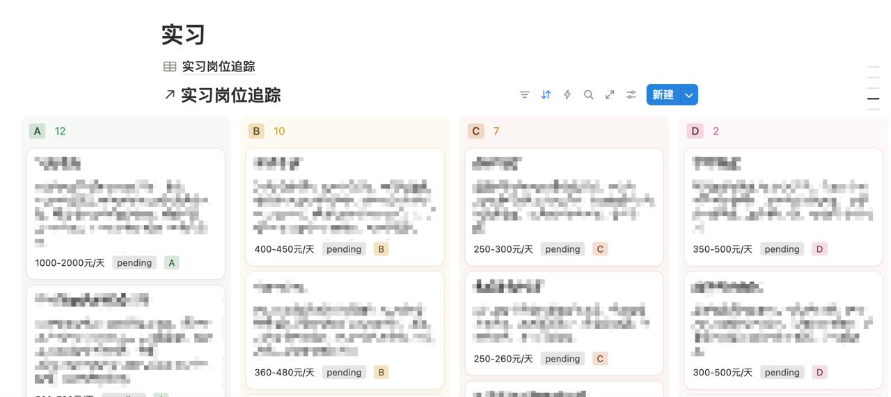

# internship-scout

一个 OpenClaw Agent Skill，用于从 BOSS直聘自动寻找实习岗位、提取 JD 原文、AI 评分打标，并同步到 Notion。



## 功能

- **抓取职位列表**：根据用户偏好（城市、日薪、规模、关键词）调用 BOSS直聘内部 API，自动过滤大厂、非技术岗、低薪岗位
- **提取 JD 原文**：通过 osascript 控制 Chrome，DOM 抓取每个职位的完整 JD 文本
- **AI 评分打标**：spawn subagent 对所有待处理 JD 进行三维评分（职责清晰度 / 技术栈明确度 / 岗位匹配信号），生成 summary、tags、quality（A/B/C/D/F）
- **Notion 同步**：将评分结果 upsert 到 Notion 数据库，支持新增、更新、全量同步

## 工作流

```
fetch_job_links.py → fetch_jd_dom.py → summarize_jds.py → notion_sync.py
  (抓列表+结构字段)    (DOM抓JD原文)     (subagent评分)      (Notion同步)
```

## 依赖

- macOS + Chrome（需开启 `View > Developer > Allow JavaScript from Apple Events`）
- OpenClaw（agent 运行环境）
- Notion API Key（可选，用于同步）

## 安装

### 通过 OpenClaw Agent 安装

把以下内容发送给你的 agent：

```
Fetch https://raw.githubusercontent.com/wkf16/internship-scout/main/INSTALL_AGENT.md and follow the instructions to install internship-scout skill.
```

### 手动安装

```bash
git clone https://github.com/wkf16/internship-scout.git \
  ~/.openclaw/workspace/skills/internship-scout
```

## 使用

直接告诉你的 agent：

- 「帮我搜一下上海的 AI Agent 实习」
- 「抓一下 BOSS 上的大模型实习岗位」
- 「把实习列表同步到 Notion」
- 「重新评分所有 JD」

## 文件结构

```
internship-scout/
├── SKILL.md                     # Agent 操作指南
├── references/
│   ├── schema.md                # YAML 字段定义
│   └── prefs-template.md        # 偏好配置模板
└── scripts/
    ├── fetch_job_links.py       # 抓职位列表
    ├── fetch_jd_dom.py          # 抓 JD 原文
    ├── summarize_jds.py         # AI 评分打标
    ├── notion_sync.py           # Notion 同步
    └── dedup_check.py           # 去重检查
```

数据文件（存放在 workspace 根目录，不含在本 repo 中）：
- `internships.yaml` — 所有收录的职位
- `internship-prefs.md` — 用户偏好配置
